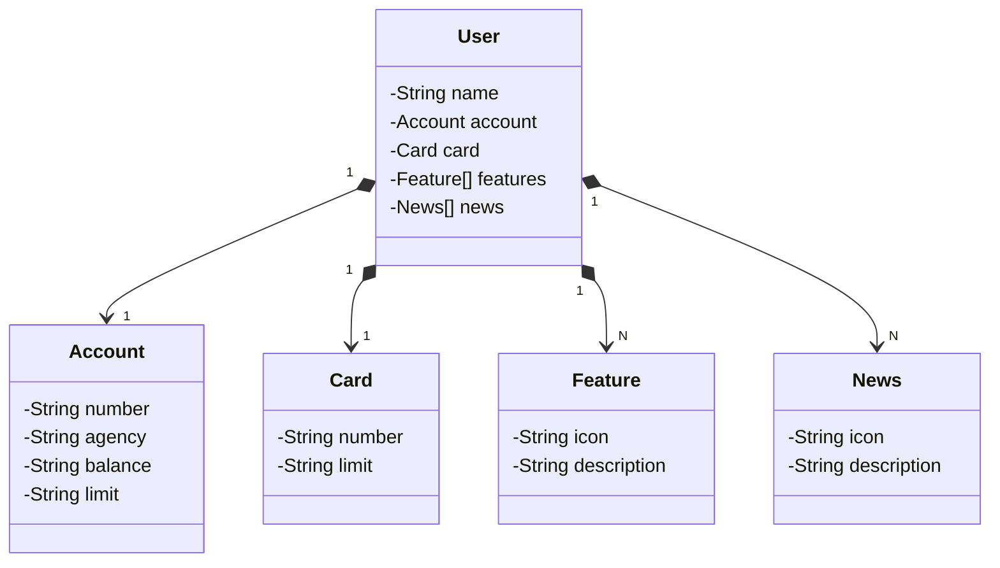

# Santander Back-End 2024
Java RESTful API criada para o bootCamp Santander Back-End 2024

## Principais Tecnologias

Java 17

Spring Boot 3

Spring Data JPA

OpenAPI (Swagger)

Railway

## [Link do Figma](https://www.figma.com/file/0ZsjwjsYlYd3timxqMWlbj/SANTANDER---Projeto-Web%2FMobile?type=design&node-id=1421%3A432&mode=design&t=6dPQuerScEQH0zAn-1)
O Figma foi utilizado para a abstração do domínio desta API, sendo útil na análise e projeto da solução.

## Diagrama de Classes

